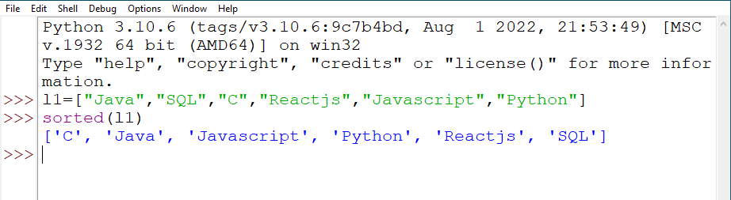
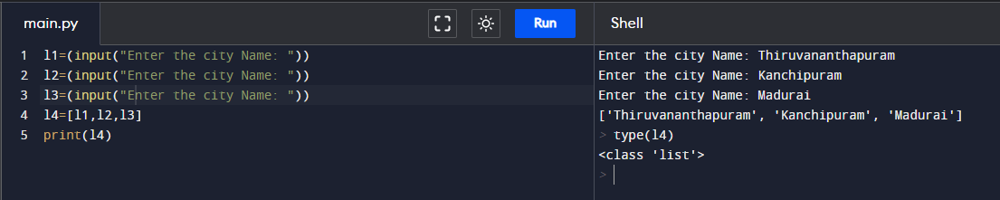

# Assignment - 13 Full Stack Web Development using Python MySirG List

    Qns 1. Write a python script to store multiple items in a single variable ( Items are “Java” ,“Python”, “SQL”, “C” ) using list.

    Ans. 

    Qns 2. Write a python script to get the data type of a list.

    Ans.

    Qns 3. Write a python script to get the last item of the list ( mylist = ["Java", "C", "Python"]).

    Ans.

    Qns 4. Write a python script to Change the values "SQL" and "Reactnative" with the values "NoSQL" and "Flutter" (List is thislist = ["Java", "SQL", "C", "Reactnative","Javascript", "Python"].

    Ans.

    Qns 5. Write a python script to add an item to the end of the list (item “Python”. (mylist = ["Java", "SQL", "C", "Reactnative"].

    Ans.

    Qns 6. Write a python program to append elements from another list to the current list.(firstlist = ["Java", "Python", "SQL"]
    secondlist = ["C", "Cpp", "NoSQL"] ).

    Ans.

    Qns 7. Write a python program to Print all items by referring to their index number (thislist = ["Java", "SQL", "C", "Reactnative", "Javascript", "Python"].

    Ans.

    Qns 8. Write a python program to sort the list alphanumerically – thislist = ["Java", "SQL","C", "Reactjs", "Javascript", "Python"].

    Ans.

    Qns 9. Write a Python script to create a list of city names taken from the user.

    Ans.

    Qns 10. Write a Python script to create a list, where each element of the list is a digit of a given number.

    Ans.

